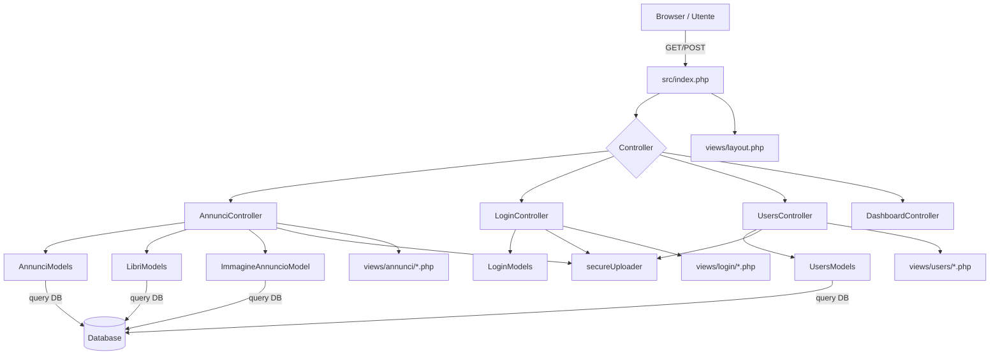

# Architettura del progetto OurShelf

## 1. Panoramica generale

Questo progetto è organizzato come un'app PHP basata su un pattern MVC semplificato:

- `src/index.php` gestisce il routing principale e costruisce il controller corretto.
- `src/controllers/` contiene la logica di controllo per le pagine e le azioni.
- `src/models/` contiene le classi che comunicano con il database.
- `src/views/` contiene i template PHP che generano l'HTML.
- `src/utils/` contiene helper e il `secureUploader` per la gestione sicura dei file.

Il flusso è:

- l'utente richiama `index.php?page=X&action=Y`
- il router crea il controller `XController`
- chiama il metodo `Y()` corrispondente
- il controller usa i model per leggere/scrivere dati
- infine include una view dentro `views/layout.php`

## 2. Diagramma architetturale MVC



## 3. Routing e bootstrap (`src/index.php`)

`src/index.php`:

- avvia la sessione
- prepara gli array `$_SESSION['errors']` e `$_SESSION['success']`
- include `src/utils/helpers.php`
- legge `page` e `action` da `$_GET`
- costruisce il nome del controller `ucfirst($page) . 'Controller'`
- include il file controller corrispondente e chiama il metodo richiesto
- se la pagina non esiste, reindirizza a `home`

Questo significa che un URL come `index.php?page=annunci&action=dettaglio&id=5` esegue `AnnunciController::dettaglio()`.

```php
// src/index.php
$page = $_GET['page'] ?? 'home';
$action = $_GET['action'] ?? 'index';

$filename = ucfirst($page) . 'Controller';
$path = __DIR__ . "/controllers/{$filename}.php";

if (file_exists($path)) {
  require_once $path;
  if (class_exists($filename)) {
    $controller = new $filename();

    if (method_exists($controller, $action)) {
      $controller->$action();
    } else {
      die("Errore: action '$action' non esiste nel controller '$filename'.");
    }
  }
}
```

## 4. Come funziona ogni model con relativo controller

### 4.1 `AnnunciModels` + `AnnunciController`

#### `AnnunciModels`

Gestisce la tabella `Annunci` e i dati correlati:

- `getAnnunci(...)`: recupera la lista degli annunci disponibili, con join sui libri, luoghi, venditori e immagini.
- `getAnnuncioById($id)`: legge i dati completi di un annuncio singolo.
- `insertAnnuncio($params)`: crea un nuovo annuncio.
- `updateAnnuncio(...)`, `concludiAcquisto(...)` e altre operazioni sullo stato dell'annuncio.
- `getImmagineVenditoreById(...)`: legge l'avatar del venditore.

#### `AnnunciController`

Esegue le azioni utente sugli annunci:

- `index()`: mostra la bacheca annunci (usa `getAnnunci`).
- `crea()`: mostra il form di creazione annuncio.
- `store()`: salva l'annuncio nel DB e poi gestisce eventuali immagini.
- `modifica()`: mostra il form di modifica per l'annuncio proprietario.
- `update()`: aggiorna i dati di un annuncio esistente.
- `dettaglio()`: mostra la pagina dettaglio con immagini e venditore.
- `uploadImmagini()`: gestisce il caricamento di immagini aggiuntive per l'annuncio.

```php
public function uploadImmagini(): void
{
  requireLogin();

  $id_annuncio = (int)($_POST['id_annuncio'] ?? 0);
  if ($id_annuncio <= 0) {
    $_SESSION['errors'][] = "Annuncio non valido";
    header("Location: index.php?page=annunci&action=index");
    exit;
  }

  $annuncio = $this->model->getAnnuncioById($id_annuncio);
  if (!$annuncio || (int)$annuncio['proprietario'] !== (int)$_SESSION['id_studente']) {
    $_SESSION['errors'][] = "Accesso negato";
    header("Location: index.php?page=annunci&action=index");
    exit;
  }

  $this->uploader->salvaImmagineAnnuncio($id_annuncio, $_FILES['immagini']);

  header("Location: index.php?page=annunci&action=dettaglio&id=$id_annuncio");
  exit;
}
```

### 4.2 `LibriModels` + `AnnunciController`

#### `LibriModels`

Fornisce i dati del catalogo libri:

- elenco libri disponibili
- ricerca libro per ISBN
- altri dettagli utili per creare l'annuncio.

#### uso nel controller

`AnnunciController::crea()` e `AnnunciController::modifica()` usano `getAllLibri()` per popolare le select del form.

### 4.3 `ImmagineAnnuncioModel` + `AnnunciController`

#### `ImmagineAnnuncioModel`

Gestisce la tabella `Immagini_Annunci`:

- `countByAnnuncio($id_annuncio)` conteggia quante immagini sono già collegate.
- `insert($id_annuncio, $nome_file)` aggiunge il record del file nel DB.
- `getAllByAnnuncio($id_annuncio)` recupera le immagini per un annuncio.
- `getNomeFileByAnnuncio($id_annuncio)` restituisce solo i nomi dei file fisici.
- `delete($id_immagine)` elimina un record immagine.

#### uso nel controller

`AnnunciController::dettaglio()` usa `getAllByAnnuncio()` per mostrare il carousel delle immagini.
`uploadImmagini()` chiama il `secureUploader` per salvare fisicamente le immagini e registra i nomi nel DB.

### 4.4 `LoginModels` + `LoginController`

#### `LoginModels`

Fornisce la logica di autenticazione e registrazione utente:

- `authUser($email)` legge l'utente per login.
- `insertUser($params)` crea il nuovo studente.
- `emailList()` e controlli email.
- `getClassi()` per popolare le classi.

#### `LoginController`

Gestisce l'accesso e la registrazione:

- `index()`: mostra il form login.
- `check()`: verifica credenziali, crea sessione utente.
- `register()`: mostra il form registrazione.
- `store()`: crea un nuovo utente e salva l'avatar se presente.
- `changePassword()` / `updatePassword()`: gestiscono il cambio password.

### 4.5 `UsersModels` + `UsersController`

#### `UsersModels`

Gestisce la tabella `Studenti`:

- `getUser($id)` legge dati profilo.
- `updateUser(...)` aggiorna profilo e password.
- `getClassi()` legge le classi disponibili per la select.
- `updateAvatar($nomeFile, $id)` aggiorna il nome file dell'avatar.

#### `UsersController`

Gestisce la pagina profilo:

- `index()`: mostra l'area utente.
- `update()`: processa modifiche profilo, validazioni e salvataggio opzionale del nuovo avatar.

## 5. Come funzionano le views principali

### 5.1 Layout generale

`src/views/layout.php` è il template principale che include l'header, il footer e la view specifica.
Tutte le pagine vengono caricate con:

```php
$title = ...;
$view = __DIR__ . '/../views/...';
include __DIR__ . '/../views/layout.php';
```

Questo permette di avere una struttura comune e le stesse risorse CSS/JS per tutte le pagine.

### 5.2 Views `annunci`

- `views/annunci/crea.php` => form di creazione annuncio.
- `views/annunci/modifica.php` => form di modifica annuncio con dati precompilati.
- `views/annunci/dettaglio.php` => pagina dettaglio singolo annuncio, mostra immagini e dati del venditore.
- `views/annunci/upload_immagini.php` => interfaccia per caricare le foto dell'annuncio.

### 5.3 Views `login`

- `views/login/login.php` => pagina di login.
- `views/login/register.php` => pagina di registrazione.
- `views/login/change_password.php` => pagina per cambiare password.

### 5.4 Views `users`

- `views/users/index.php` => profilo utente e aggiornamento dati personali.

### 5.5 Comportamento delle view di upload immagini

`views/annunci/upload_immagini.php` mostra:

- immagini già caricate per l'annuncio
- contatore dei file rimanenti
- form `multipart/form-data` con `input type="file" name="immagini[]" multiple`
- gestione drag & drop e preview lato client
- messaggi di errore/successo provenienti dalla `$_SESSION`

```php
<form method="POST"
      action="index.php?page=annunci&action=uploadImmagini"
      enctype="multipart/form-data"
      id="form-upload">
  <input type="hidden" name="id_annuncio" value="<?= (int)$idAnnuncio ?>">

  <input type="file" id="file-input" name="immagini[]"
         accept="image/jpeg,image/png,image/webp" multiple class="d-none">

  <button type="button" onclick="document.getElementById('file-input').click()">
    Sfoglia
  </button>
</form>
```

Lo script lato client verifica:

- tipi MIME `image/jpeg`, `image/png`, `image/webp`
- dimensione massima 2 MB
- numero massimo di file rimanenti

## 6. Flusso del caricamento immagini con `secureUploader`

### 6.1 Cosa fa `secureUploader`

`src/utils/secureUploader.php` è la classe che:

- valida i file in ingresso
- genera nomi sicuri per i file
- salva fisicamente i file nelle cartelle:
  - `public/uploads/annunci/`
  - `public/uploads/users/`
- registra le immagini degli annunci nel DB
- aggiorna l'avatar dell'utente nel DB
- elimina i file fisici quando serve

### 6.2 Validazioni principali

`secureUploader::valida()` verifica:

- errori nativi PHP di upload
- dimensione file max 2 MB
- presenza del file temporaneo in `tmp_name`
- MIME reale con `finfo(FILEINFO_MIME_TYPE)`
- estensione consentita (`jpg`, `jpeg`, `png`, `webp`)
- integrità dell'immagine con `getimagesize()`

```php
private function valida(array $file): string
{
  if (($file['error'] ?? UPLOAD_ERR_NO_FILE) !== UPLOAD_ERR_OK) {
    return "Errore nel caricamento di \"{$file['name']}\".";
  }

  if (($file['size'] ?? 0) > $this->max_size) {
    return "Il file \"{$file['name']}\" supera i {$this->max_mb}MB.";
  }

  $tmp = $file['tmp_name'] ?? null;
  if (!$tmp || !is_file($tmp)) {
    return "File non disponibile.";
  }

  $finfo = new finfo(FILEINFO_MIME_TYPE);
  $mime = $finfo->file($tmp);
  if (!in_array($mime, $this->allowed_mime, true)) {
    return "Formato non consentito per \"{$file['name']}\".";
  }

  $ext = strtolower(pathinfo($file['name'], PATHINFO_EXTENSION));
  if (!in_array($ext, $this->allowed_ext, true)) {
    return "Estensione non consentita.";
  }

  $check = getimagesize($tmp);
  if ($check === false) {
    return "Il file \"{$file['name']}\" non è un'immagine valida.";
  }

  return "";
}
```

### 6.3 Generazione del nome file

`secureUploader::genera_nome()` produce nomi univoci e puliti:

- prefisso `ann` per annunci
- prefisso `user` per avatar
- id associato
- `uniqid()` per evitare conflitti

```php
private function genera_nome(string $prefisso, int $id, string $nomeOriginale): string
{
  $ext = strtolower(pathinfo($nomeOriginale, PATHINFO_EXTENSION));
  if ($ext === 'jpeg') $ext = 'jpg';
  return "{$prefisso}_{$id}_" . uniqid() . ".{$ext}";
}
```

Esempio:

- `ann_7_642af1234b7c9.jpg`
- `user_3_642af1234b7d0.png`

### 6.4 Salvataggio delle immagini dell'annuncio

Il flusso in `AnnunciController::uploadImmagini()` è:

1. l'utente invia il form con `POST index.php?page=annunci&action=uploadImmagini`
2. si verifica che l'annuncio esista e che l'utente sia proprietario
3. si controlla la presenza di almeno un file diverso da `UPLOAD_ERR_NO_FILE`
4. si chiama `$this->uploader->salvaImmagineAnnuncio($id_annuncio, $_FILES['immagini'])`

Dentro `salvaImmagineAnnuncio()`:

- si conta quante immagini esistono già per l'annuncio
- si limita il numero massimo a 3
- per ciascun file si normalizza la struttura `$_FILES`
- si valida ogni file singolarmente
- se tutto è corretto si sposta il file con `move_uploaded_file()` in `public/uploads/annunci/`
- si scrive il nome file in `Immagini_Annunci`
- i messaggi di errore o successo vengono memorizzati in `$_SESSION`

### 6.5 Salvataggio dell'avatar utente

`UsersController::update()` e `LoginController::store()` utilizzano:

- `$this->uploader->salvaAvatar($userId, $_FILES['avatar'], $vecchia_foto)`

Il metodo:

- ignora l'upload se `UPLOAD_ERR_NO_FILE`
- valida il file come immagine
- elimina il vecchio avatar se esiste
- sposta il nuovo file in `public/uploads/users/`
- aggiorna il campo `foto` nella tabella `Studenti`

### 6.6 Eliminazione delle immagini di annuncio

`secureUploader::eliminaImmaginiAnnuncio($id_annuncio)` legge i nomi file dal DB e li cancella dal disco.
Questa funzione è pensata per essere chiamata prima dell'eliminazione dell'annuncio.

## 7. Note sul funzionamento delle sessioni e degli errori

- `$_SESSION['errors']` contiene gli errori di validazione e di upload.
- `$_SESSION['success']` contiene i messaggi di successo.
- `src/utils/helpers.php` fornisce le funzioni `safe_string()`, `flash_error()`, `flash_success()` e `requireLogin()`.
- Molti controller usano `requireLogin()` per proteggere l'accesso alle pagine riservate.

## 8. Riassunto del flusso di caricamento immagini

1. Utente seleziona immagini nella view `views/annunci/upload_immagini.php`.
2. Il form invia `$_FILES['immagini']` a `AnnunciController::uploadImmagini()`.
3. Il controller verifica permessi e annuncio.
4. `secureUploader` valida e salva ogni immagine.
5. Il file fisico finisce in `public/uploads/annunci/`.
6. Il nome file viene inserito su `Immagini_Annunci`.
7. L'utente viene reindirizzato al dettaglio dell'annuncio.

## 9. Punti chiave dell'architettura MVC in questo progetto

- Il controller è il punto centrale: media tra HTTP, Modelli e Views.
- I model non producono output HTML, si occupano solo di database.
- Le view ricevono dati dal controller e stampano l'interfaccia.
- Il `secureUploader` è una utility trasversale, usata da più controller per separare la logica upload dal resto.

---

Questo file documenta il funzionamento principale dell'app OurShelf, con una attenzione speciale al percorso MVC e al caricamento immagini sicuro.
